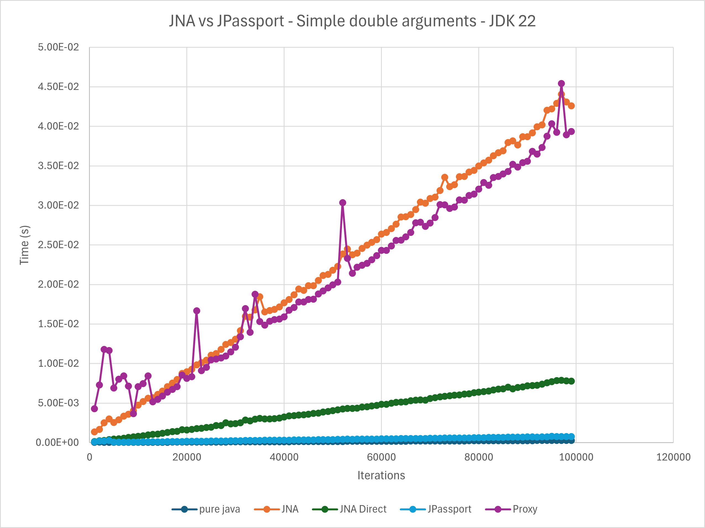
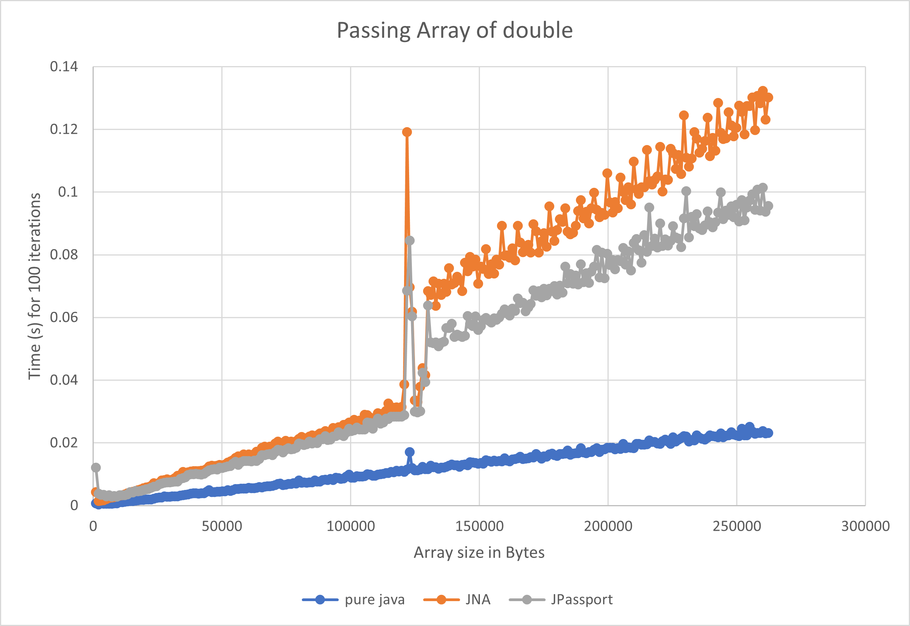

# JPassport

JPassport works like Java Native Access (JNA) but uses the Foreign Linker API instead of JNI. 
Similar to JNA, in order to call an external C library you need to declare a Java interface 
with the method definitions that match the methods in the external library. 
JPassport will build a class that implements your interface
and manages calls into the library. JPassport is not as full featured as JNA at this time 
(see the Limitations below) but for simple applications it would be a near drop in replacement.

The Foreign Linker API is still an incubator at this time and Java 16 at least is required to use this library.

# Getting started

Download the source and run the maven build, or run the ant build.

# Example

C:
```
int string_length(const char* string)
{
    return strlen(string);
}

double sumArrD(const double *arr, const int count)
{
    double r = 0;
    for (int n = 0; n < count; ++n)
        r += arr[n];
    return r;
}
```

Java:
```Java
public interface Linked extends Passport {
   int string_length(String s);
   double sumArrD(double[] arr, int count);
}
```
Java Usage:
```Java
Linked L = PassportFactory.link("libforeign", Linked.class);
int n = L.string_length("hello");
double sum = L.sumArrD(new double[] {1, 2, 3}, 3);
```

In order to use this library you will need to provide the VM these arguments:

__-Djava.library.path=[path to lib] -Dforeign.restricted=permit__

# Performance
The testing classes I have use JNA, JNA Direct, JPassport and pure Java.

Performance of method that passes 2 doubles:



Performance of method that passes an array of doubles



(Tests were run on Windows 10 with an i7-10850H.)

# How it works

There are 2 stages to make the foreign linking work:

1. The interface is scanned for non-static methods. The given library is searched to find methods that match the names given in the Java interface.
2. A new class is written using the given interface and then compiled. The created class does the required data conversions to call into the library.

Using compiled classes rather than interface proxy objects makes the solution fairly efficient.

By default, the classes are written to the folder specified by System.getProperty("java.io.tmpdir").
If you provide the system property "jpassport.build.home" then the classes will be written and
compiled there.

# Library Data Types that work

Methods with the following C data types for arguments can be called:
1. double, double*, double[], double**, double[][]
2. float, float*, float[], float**, float[][]
3. long, long*, long[], long**, long[][]
4. int, int*, int[], int**, int[][]
5. short, short*, short[], short**, short[][]
6. char, char*, char[], char**, char[][]
7. any other pointer (see Limitations)

Any C argument that is defined with ** must be annotated with @PTrPtrArg in your Java interface.

Return types can be:
1. double
2. float
3. long
4. int
5. short
6. char
7. void
8. char*
9. any pointer (see limitations)

If an argument is changed by the library call then the @RefArg annotation is required for that argument. Ex.

C:
```
void readB(int *val, int set)
{
    *val = set;
}
```

Java:
```Java
public interface Test extends Passport {
  void readD(@RefArg int[] d, int set);
}

Linked lib = PassportFactory.link("libforeign_link", Test.class);
int ref[] = new int[1];
lib.readD(ref, 10);
```

Without the @RefArg, when ref[] is returned it will not have been updated.

# Limitations

* Struct arguments to C functions do not work.
* The interface file passed to LinkFactory must be exported by your module.

Pointers as function returns only work in a limited fashion. Based on a C 
function declaration there isn't a way to tell exactly what a method is returning.
For example, returning int* could return any number of ints. There is
little a library like JPassport can do to handle returned pointers automatically. 
The work-around is for your interface function return MemoryAddress. From there
it would be up to you to decipher the return. 

Declaring your interface method to take MemoryAddress objects allow you to
manage passing your own structs as well.

```
double* mallocDoubles(const int count)
{
    double* ret = malloc(count *sizeof(double ));

    for (int n = 0; n < count; ++n)
        ret[n] = (double)n;

    return ret;
}

void freeMemory(void *memory)
{
    free(memory);
}
```

```Java
public interface TestLink extends Passport {
    MemoryAddress mallocDoubles(int count);
    void freeMemory(MemoryAddress addr);
}

double[] testReturnPointer(int count) {
    MemoryAddress address = linked_lib.mallocDoubles(count);
    double[] values = new double[count];
    // Use the provided Util function to copy data out of the MemorySegment
    Utils.toArr(values, address.asSegmentRestricted(count * Double.BYTES));
    linked_lib.freeMemory(address);
    return values;
}

```
# Dependencies

JPassport itself only requires at least Java 16 to build and run.

The testing classes require:

* JNA 5.8.0
* JUnit 5.4.2 (later versions of JUnit do not play nice with modules yet)
* Apache Commons CSV 1.8 (only used to output performance data)

# Work To-Do
Roughly in order of importance

1. Support struct arguments.
2. Use the Java Micro-benchmarking harness.
3. Compile classes in memory instead of from disk
