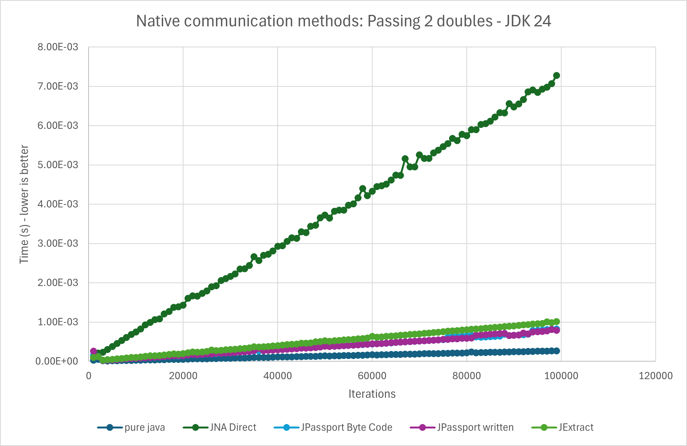
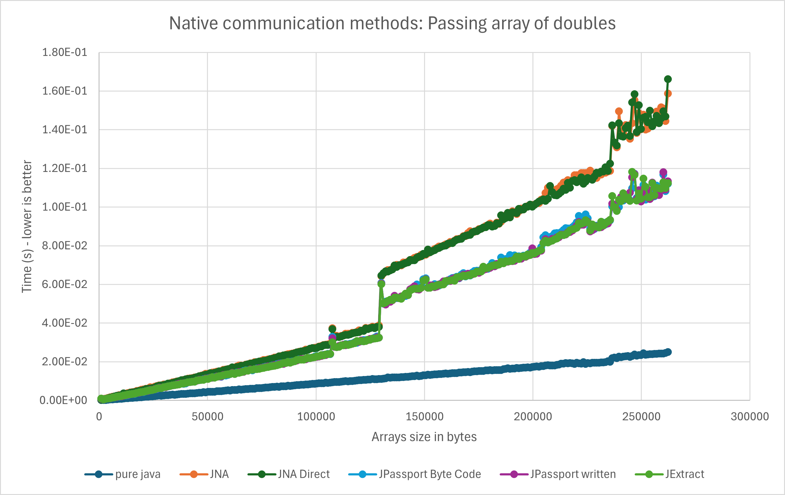

# JPassport - Java 24

JPassport works like [Java Native Access (JNA)](https://github.com/java-native-access/jna) but uses the 
[Foreign Function and Memory API](https://openjdk.java.net/jeps/393) (FFM) instead of JNI. 
Similar to JNA, you declare a Java interface that is bound to the external C library using method names.  
The goal of this project is to provide a JNA-like experience for anyone wanting to access native code.

JNA is a much more mature project than this one and, it supports Java 8 and earlier. I am NOT a JNA expert.
JPassport was able to build on new language features to make this library (hopefully) simpler to use 
(ex. I think my struct support is cleaner because I could rely on the formal structure of records). 
If you cannot use a recent Java version then JNA is your best bet. However, if you can use a recent JRE then 
this library is much lighter weight than JNA (100 kb vs 3+ MB) and the programing should be simpler
for many cases. I also hope that in many cases, changing to JPassport from existing JNA code shouldn't be
an onerous task.

The FFM team maintain a tool called [JExtract](https://github.com/openjdk/panama-foreign/blob/foreign-jextract/doc/panama_jextract.md). Given a header file (.h), JExtract will write the required
Java code to access the native code described in the header. I haven't used JExtract much. In order
to use the code it generates you need to be somewhat familiar with FFM and, if I understand correctly,
for proper struct support you need to have it generate code for each platform you want to support. 
Maybe for large header files JExtract is a quicker route. But if your goal is simple, easy to read Java code
the JPassport is a better route.

**Java 24 and later** are required to use this library. There are separate branches for Java 17 to 22.

[FFM](https://docs.oracle.com/en/java/javase/22/core/foreign-function-and-memory-api.html) is final in 
Java 22. The [Class-file API](https://docs.oracle.com/en/java/javase/24/docs/api/java.base/java/lang/classfile/package-summary.html) is final in Java 24.

# Getting Started

### Source
Download the source and run the maven build, or use the maven dependency:

        <dependency>
            <groupId>io.github.boulder-on</groupId>
            <artifactId>JPassport</artifactId>
            <version>1.1.0-24</version>
        </dependency>

If you would like to see the Java code or byte code created use:
```java
System.setProperty("jpassport.build.home", [folder location]);
```

When using JPassport you will get a warning from the JVM like:

```
WARNING: A restricted method in java.lang.System has been called
WARNING: java.lang.System::load has been called by jpassport.PassportFactory in an unnamed module
WARNING: Use --enable-native-access=ALL-UNNAMED to avoid a warning for callers in this module
WARNING: Restricted methods will be blocked in a future release unless native access is enabled
```

In order to avoid this warning, start your java process with the command line argument:

```
--enable-native-access=ALL-UNNAMED

or 

--enable-native-access=jpassport
```

If you get an __java.lang.UnsatisfiedLinkError__ then you will need to provide the path to your library
either as a command line argument or in your PassportFactory.link call.

__-Djava.library.path=[path to lib]__

# Calling a native library example

The native api refers to these as "down calls".

C, compiled into libforeign.dll or libforeign.so:
```
int string_length(const char* string)
{
    return strlen(string);
}

double sumArrD(const double *arr, const int count)
{
    double r = 0;
    for (int n = 0; n < count; ++n)
        r += arr[n];
    return r;
}
```

Java Interface:
```Java
public interface Linked extends Passport {
   int string_length(String s);
   double sumArrD(double[] arr, int count);
}
```
Standard usage - creates a class in memory using the Classfile API:
```Java
Linked L = PassportFactory.link("libforeign", Linked.class); 
int n = L.string_length("hello");
double sum = L.sumArrD(new double[] {1, 2, 3}, 3);
```

Static usage - writes a .java file to disk that you can include in your codebase:
```java
PassportWriter pw = new PassportWriter(Linked.class);
pw.writeModule(Path.of('output_location'));
```
Once the class is compiled, to use it:
```java
Linked l = new Linked_Impl(PassportFactory.loadMethodHandles("libforeign", Linked.class));
```

JPassport works in one of 2 modes:

1. Using the Class-file API to build a class that implements the given interface. 
   1. PassportFactory.link()
   2. This is a fast method that creates generally fast code (in my example code it takes about 20ms to generate the class)
2. Writing a class that implements your interface, compiling it and passing it back to you. 
   1. PassportFactory.link_written()
   2. The process to write, compile and load the class is relatively slow, but that is a one-time cost. (in my example code it takes about 2s to generate the class)
   3. This method creates code you can see and hand optimize (see jpassport.build.home)

# Callback example

The native API refers to these as "up calls". It's common in native programming to pass a function
as a pointer into another function. This technique is used to create call-backs.

```java
import jpassport.pointers.FunctionPtr;

public interface CallbackNative extends Passport {
    void passMethod(FunctionPtr functionPtr);
}

public class MyCallback {
    public void callbackMethod(int value, String name) {
        System.out.println(value + ". " + name);
    }
}

MyCallback cb = new MyCallback();
FunctionPtr functionPtr = PassportFactory.createCallback(cb, "callbackMethod");

CallbackNative cbn = PassportFactory.link("libforeign", CallbackNative.class);
cbn.passMethod(functionPtr);
```

At the moment, this does not work for static java methods.

__NOTE:__ If your callback method uses Java synchronization, or interacts with object member variables
then the thread must be a Java thread. In testing I've done, if a callback is called from a 
normal Linux Thread then synchronized blocks do not work.

# Performance
Performance was tested vs JNA, JNA Direct, and pure Java.

Performance of a method that passes 2 doubles. JPassport is about 5x faster than
JNA. JNA Direct is impressively fast. JPassport that uses a proxy class performs
quite poorly because of its heavy use of reflection.



Performance of a method that passes an array of doubles. The gap here
 is much smaller between JNA and JPassport.



(Tests were run on Windows 11 with an i7-10850H.)

# C Data Types Handled Automatically

| C Data Type       | Java Data Type                                              |
|-------------------|-------------------------------------------------------------|
| double            | double                                                      |
| double*, double[] | double[]                                                    |
| double**          | @PtrPtrArg double[][]                                       |
| double[][]        | double[][]                                                  |
| float             | float                                                       |
| float*, float[]   | float[]                                                     |
| float**           | @PtrPtrArg float[][]                                        |
| float[][]         | float[][]                                                   |
| long              | long                                                        |
| long*, long[]     | long[]                                                      |
| long**            | @PtrPtrArg long[][]                                         |
| long[][]          | long[][]                                                    |
| int               | int                                                         |
| int*, int[]       | int[]                                                       |
| int**             | @PtrPtrArg int[][]                                          |
| int[][]           | int[][]                                                     |
| short             | short                                                       |
| short*, short[]   | short[]                                                     |
| short**           | @PtrPtrArg short[][]                                        |
| short[][]         | short[][]                                                   |
| char              | byte                                                        |
| char*             | byte[] or String                                            |
| char[]            | byte[] or String                                            |
| char**            | @PtrPtrArg byte[][]                                         |
| char[][]          | byte[][]                                                    |
| structs           | Records                                                     |
| char*, void *     | MemoryBlock                                                 |
| char*, void *     | GenericPtr (Useful if a native method returns a pointer)    |
| char*, void *     | MemorySegment (if you are doing your own memory magagement) |
| n/a               | Arena (see below)                                           |

Any C argument that is defined with ** must be annotated with @PTrPtrArg in your Java interface.

An **Arena** object can be added to any interface method signature. JPassport will use
that Arena to allocate memory instead of creating its own Arena. This can help with
efficiency by allowing you to hold a large block of memory open longer, rather
than regularly re-allocating it. Only one Arena can be passed.

Return types can be:
1. double
2. float
3. long
4. int
5. short
6. char
7. void
8. char* (maps to a Java String)
9. any pointer (see limitations)

If an argument is changed by the C library call then the @RefArg annotation is required for that argument. 
The argument also needs to be passed as an array of length one. Ex.

C:
```
void setInt(int *val, int set)
{
    *val = set;
}
```

Java:
```Java
public interface Test extends Passport {
  void setInt(@RefArg int[] d, int set);
}

Linked lib = PassportFactory.link("foreign_link", Test.class);
int[] ref = new int[1];
lib.setInt(ref, 10);
```

Without the @RefArg, when ref[] is returned it will not have been updated.

@RefArg can be used to annotate your entire interface. In that case, all methods
that use arrays will be handled as reference arguments.

## Structs and Records
In order to handle C Structs you must make an equivalent Java Record. For example
```
struct PassingData
{
    int s_int;
    long long s_long;
    float s_float;
    double s_double;
};

struct ComplexPassing
{
    int s_ID;
    struct PassingData s_passingData;
    struct PassingData* s_ptrPassingData;
    char* s_string;
};

double passSimple(struct PassingData* complex)
{
...
}

double passComplex(struct ComplexPassing* complex)
{
...
}
```

```java
import jpassport.annotations.RefArg;

public record PassingData(
        long s_long,
        double s_double) {
}

public record ComplexPassing(
        int ID,
        PassingData ts,
        @Ptr TestStruct tsPtr,
        String string) {
}

public interface PerfTest extends Passport {
    double passStruct(PassingData structData);
    double passComplex(@RefArg ComplexPassing[] complexStruct);
}
```

The @Ptr annotation lets JPassport know to treat the member of the struct as
a pointer to another struct.

Arrays of Records can only be 1 element long. Longer arrays of Records are not supported.

Records can contain primitives, arrays of primitives, GenericPtr, arrays of GenericPtr, pointers to arrays of primitives, Strings, or pointers
to other Records.

Records are used to model structs mainly for convenience in the library. Records have a 
well-defined constructor and set of automatically generated methods. This means that the 
library can make assumptions about how to pull data out of the class and how to pull data
out of memory and create a new class. Without these built in assumptions, the complexity 
of the code would be terrible, and using MiscUnsafe might be required.

Structs often require padding bytes to align on 4 or 8 byte boundaries. JPassport
calculates this padding automatically based on your platform. However, if it's done
wrong then you can use the  @StructPadding annotation to implement custom padding.
You can also you this annotation to ignore sections of a struct you don't care about.

# Capturing Errors
FFM has the ability to capture errors that occurred during a call. For instance,
some C methods will set "errno" during a call. Or in windows GetLastError() can contain 
valuable information. Those values need to be collected by the JVM as soon as the native
call is done. JPassport automates this for you with the ErrorCapture class.

```Java
import jpassport.ErrorCapture;

import java.lang.foreign.MemorySegment;

public interface ErrCapTest extends Passport {
    MemorySegment malloc(ErrorCapture err, int size);
}

ErrCapTest errCapTest = ...
ErrorCapture errors = new ErrorCapture();
MemorySegment mem = errCapTest.malloc(errors, Integer.MAX_VALUE);

if (mem.equals(MemorySegment.NULL)) {
    System.out.println(errors);
    int errno = errors.getError("errno");
    if (errno != 0)
        System.out.println("The error encountered was: " + errno);
}

```
Notice that ErrorCapture is not a real argument of the malloc function.
We just inject the ErrorCapture class here to grab the
errors that the JVM found before returning from the native call.

NOTE: The errors that are returned are done by name. Each platform will
have different names available. Calling MemorySegment.toString() will show
you all that are available.

# Annotations
JPassport uses annotations as code generation hints. The available annotations are:

| Annotation                   | Usage          | Meaning                                                                                                                                                                |
|------------------------------|----------------|------------------------------------------------------------------------------------------------------------------------------------------------------------------------|
| Array                        | Record members | If a C Struct takes a pointer to a primative array, this allows you to say what the size of the primative array is for RefArgs.                                        |
| NotRequired                  | Methods | If a function could not be found in the native library then no exception will be thrown. Use Passport.hasMethod("") to determine if the function was found.            |                    |
| Ptr                          | Record members | If a C Struct takes a pointer to a primative or another struct then use this annotation.                                                                               |
| PtrPtrArg                    | Function argument| Any C function that takes a **<arg> must be annotated with this.                                                                                                       |
| RefArg                       | Function argument | Any C function that changes the contents of a pointer must be annotated with this to force the read back of the parameter                                              |
| RefArg (read_back_only=true) | Function argument | If you only need to pass a blank memory space for a method to fill, use this optimization, otherwise the values in the array are copied to memory that is passed to C. |
| StructPadding                | Record members | See the Javadoc or the above section on structs and records.                                                                                                           |
| Critical                     | Methods  | Removes some overhead for calling a native method. Cannot be used when callbacks are used. See the JDK's Linker.Option.critical for more details.                      |
# Limitations

* Only arrays of Records of length 1 work.
* Only 1D and 2D arrays of primitives are supported, deeper nestings do not work.
* The interface file passed to PassportFactory and all required Records must be exported by your module.

Pointers as function returns only work in a limited fashion. Based on a C 
function declaration, there isn't a way to tell exactly what a method is returning.
For example, returning int* could return any number of ints. There is
little a library like JPassport can do to handle returned pointers automatically. 
The work-around is for your interface function to return MemorySegment. From there
it would be up to you to decipher the return. 

Declaring your interface method to take MemorySegment objects allows you to
manage all the data yourself (like JExtract).

```
double* mallocDoubles(const int count)
{
    double* ret = malloc(count * sizeof(double ));

    for (int n = 0; n < count; ++n)
        ret[n] = (double)n;

    return ret;
}

void freeMemory(void *memory)
{
    free(memory);
}
```

```Java
public interface TestLink extends Passport {
    MemorySegment mallocDoubles(int count);
    void freeMemory(MemorySegment addr);
}

double[] testReturnPointer(int count) {
    MemorySegment address = linked_lib.mallocDoubles(count);
    double[] values = Utils.toArrDouble(address, count);
    linked_lib.freeMemory(address);
    return values;
}
```
# Dependencies

JPassport itself only requires **Java 24 or later** to build and run. There are separate Java 17-22 branches. 


# Work To-Do
Roughly in order of importance

1. Support arrays of Records 
2. Support returning a Record

# Release Notes
- 1.2.0-24 (not released yet)
  - Moved all record/struct reading and writing to the Classfile API instead of reflection (for speed)
  - Added MemoryBlock as a valid struct member
  - Code reorganization to hide classes that are not part of the API that a programmer needs to care about.
  - Fixed some issue passing booleans.
  - Added ErrorCapture
  - Cleanup the code that writes a java class (PassportFactory.link_written())
  - Deprecated the proxy implementation
- 1.1.0-24
  - Add support for building classes with the Classfile API
- 1.0.1-22
  - Fixed an issue where System libraries could not be loaded (ex. malloc).
- 1.0.0-22
  - Full 1.0 since Java 22 has gone GA and the foreign function API is now official
  - Added MemoryBlock as a method argument to pass allocated memory to a foreign function.
  - An Arena can now be an argument to a method. The Arena will be used for allocations during the call. In some cases this may be an optimization. 
- 0.7.0-22
  - Support Java 22
  - Added support for arrays of GenericPointer
  - Added Pointer as a sub-class of GenericPointer for better JNA compatability
  - Added the ability to use a Proxy object rather than writing a full new class
    - Using a Proxy is faster to create, but slower to invoke. Proxies are much slower than invoking a normal method, but the code to handle the native call is much less optimized as well.  
  - The RefArg annotation can be added to an interface to indicate that all arrays should be read back after a call.
- 0.6.0-21
  - Support Java 21
  - Make specifying byte padding in records/structs optional.
- 0.6 
  - Added the version of Java the library uses to the version (0.6.0-[java version])
  - Added GenericPointer returns and method arguments.
  - Added @NotRequired annotation for methods that may not exist.
  - Default functions in the interface are now ignored.
- 0.5
  - Added the GenericPointer class to help with returning things like win32 HANDLEs
  - Added RefArg(read_back_only = true) to optimize the returning of reference arguments.
- 0.5
  - Fixed and issue where zero argument methods would not compile
  - Fixed issues where passing and receiving null values caused their own NullPointerExceptions
- 0.4
  - Original release
